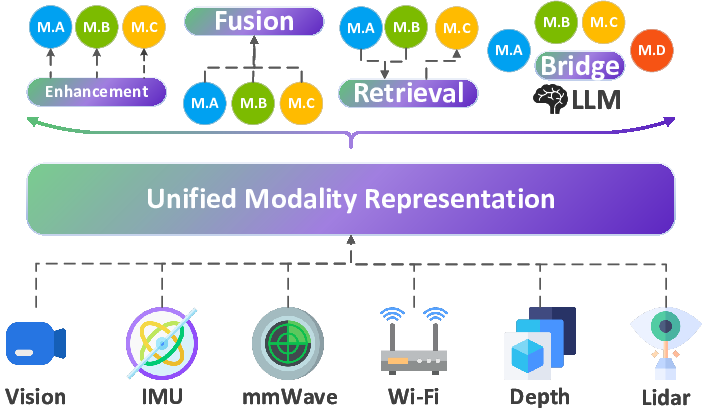

# 📡 Babel: A Scalable Pre-trained Model for Multi-Modal Sensing via Expandable Modality Alignment

This repository provides an implementation (codebase and pre-trained weights) for **[Babel](https://arxiv.org/pdf/2407.17777)**, a scalable foundation model for multi-modal sensing. Babel aligns six sensing modalities — **Wi-Fi**, **mmWave**, **IMU**, **LiDAR**, **video**, and **depth/skeleton** — using a novel **expandable modality alignment** framework that enables sequential, pairwise alignment using partially paired datasets.

> 📰 **Paper:** [SenSys 2025](https://arxiv.org/pdf/2407.17777)

---



## 🔧 Key Features

- **Expandable Modality Alignment**: Decomposes N-way alignment into sequential binary alignment stages using shared modalities.
- **Support for 6 Sensing Modalities**: Wi-Fi, mmWave, IMU, LiDAR, video (RGB), and depth/skeleton.
- **Pre-trained Modality Towers**: Leverages SOTA encoders (e.g., LIMU-BERT, ST-GCN, ResNet3D, PointTransformer).
- **Adaptive Training Strategy**: Dynamically reweights contrastive gradients during network growth using gradient-based metrics.
- **Foundation Model Utility**: Enables one-/few-shot learning for HAR, cross-modal retrieval (e.g., IMU → image), and integration with LLMs.

---

## 📦 Installation

```bash
git clone https://github.com/I-ESC/Project-Babel.git
cd Project-Babel
conda create -n babel python=3.10
conda activate babel
pip install -r requirements.txt
```
📁 **Preprocessed datasets and pre-trained modality models** can be accessed via:  
[📦 Google Drive Folder](https://drive.google.com/drive/folders/19pRwJ_4aC0jfEaowILLreBIYGgfMj5eZ?usp=sharing)

---
### 📥 Available Checkpoints

We provide a pre-trained alignment model for the following modality order:

> ✅ `offline_expandood_offline_expandmmwave_MMFi_dataset_offline_expand_offline_expandcsi`

The trained model checkpoints for this order are available at:  
[📁 Google Drive (alignment_runs_0624)](https://drive.google.com/drive/folders/19pRwJ_4aC0jfEaowILLreBIYGgfMj5eZ?usp=sharing)

> ℹ️ More alignment orders and evaluation results will be uploaded progressively.

## 🧩 External Pre-trained Models

Babel leverages several open-source models as modality-specific encoders. We gratefully acknowledge the following publicly available works:

| Modality   | Encoder              | Source & Reference |
|------------|----------------------|---------------------|
| Wi-Fi      | ViT, CNN+GRU         | [WiFi-CSI-Sensing-Benchmark](https://github.com/xyanchen/WiFi-CSI-Sensing-Benchmark) |
| Skeleton   | ST-GCN               | [ST-GCN GitHub ](https://github.com/yysijie/st-gcn/blob/master/OLD_README.md) |
| IMU        | LIMU-BERT            | [LIMU-BERT GitHub ](https://github.com/dapowan/LIMU-BERT-Public) |


> 🔍 These encoders are integrated as pre-trained modality towers (frozen or fine-tuned) within the Babel alignment framework. Please consult their original repositories for licensing and reuse terms.


## 🚀 Running the Babel

### 🔁 Full Modality Alignment

Use `run_orders.sh` to perform full alignment across all dataset orders. This script:

- Automatically chains checkpoints from prior alignment steps
- Assigns tasks to available GPUs
- Creates output directories per modality order

```bash
bash run_orders.sh
```


---

### 📈 One-/Few-Shot Evaluation

Run `run_eval.sh` to evaluate Babel’s modality encoders on **HAR** downstream tasks using linear probing.

```bash
bash run_eval.sh
```

---

## 💡 Example Applications

| Task                      | Description                                                                 |
|---------------------------|-----------------------------------------------------------------------------|
| HAR (One/Few-Shot)        | Single-modality and fusion-based recognition on 8 datasets                  |
| Cross-Modality Retrieval  | IMU → Visual image generation via alignment with diffusion model (e.g., unCLIP) |
| LLM Integration           | IMU → Language via Babel + Video-LLaMA for multi-modal QA                   |

---


## 📄 Citation

If you use this repo, please cite our paper:

```bibtex
@inproceedings{babel_sensys_25,
  author = {Dai, Shenghong and Jiang, Shiqi and Yang, Yifan and Cao, Ting and Li, Mo and Banerjee, Suman and Qiu, Lili},
  title = {Babel: A Scalable Pre-trained Model for Multi-Modal Sensing via Expandable Modality Alignment},
  year = {2025},
  isbn = {37150143722068},
  publisher = {Association for Computing Machinery},
  address = {Irvine, CA, USA},
  url = {https://doi.org/10.1145/3715014.3722068},
  doi = {3715014.3722068},
  booktitle = {Proceedings of the 23rd ACM Conference on Embedded Networked Sensor Systems},
  series = {SenSys '25},
}
```

---

## 📮 Contact

For questions or feedback, please open an issue or reach out to:

**Shenghong Dai**  
📧 sdai37@wisc.edu

---
